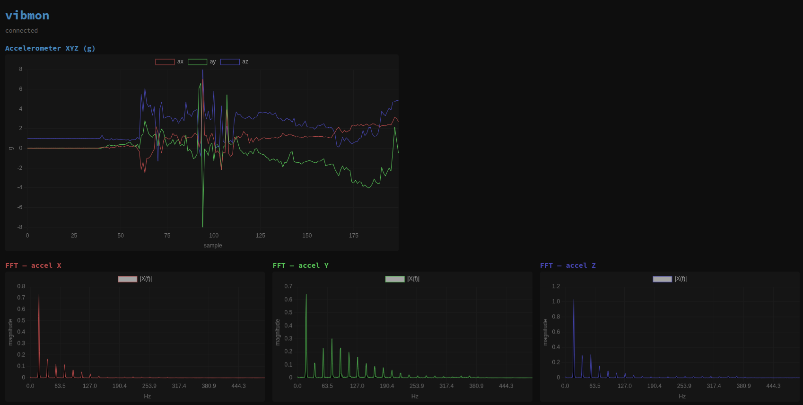
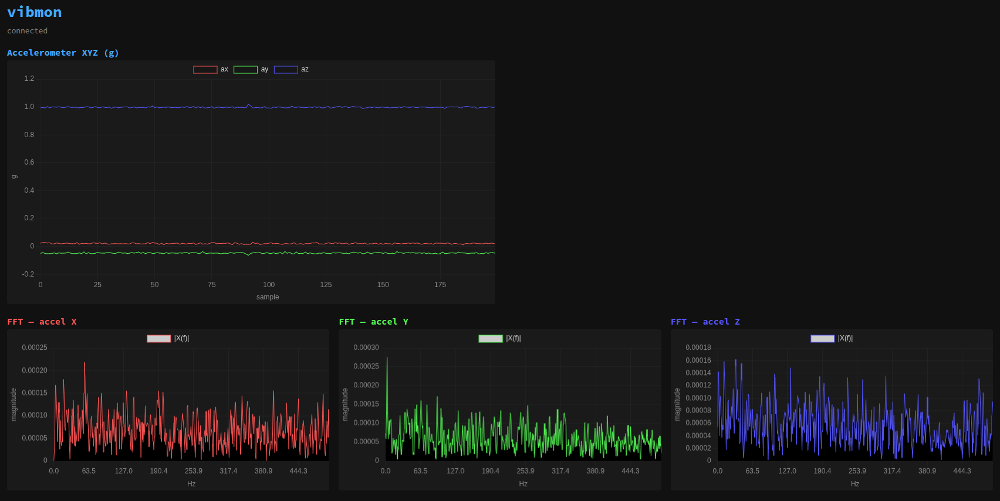
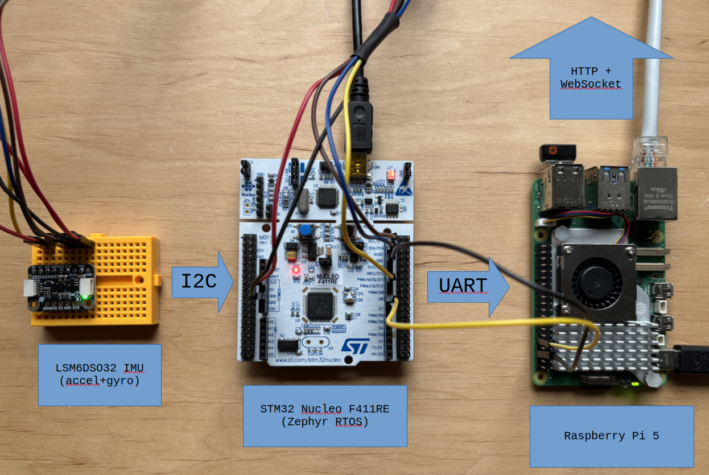

# vibmon-gateway

> Linux edge gateway for real-time IMU vibration monitoring. Receives
> COBS-framed sensor data from a Zephyr RTOS node over UART, computes
> FFT vibration spectrum, and serves a live WebSocket dashboard.

Part of a **Linux-RTOS hybrid vibration monitoring system** — see the [sister repos](#related-repositories) for the Zephyr firmware, kernel module, and Buildroot image.

---

## Dashboard

Impact event captured — FFT harmonics visible across all three axes:



Idle / low-vibration state:



---

## System Overview



```
┌──────────────────────────────┐  UART   ┌─────────────────────────────────┐
│  STM32 Nucleo F411RE         │────────▶│  Raspberry Pi 5                 │
│  Zephyr RTOS                 │  1kHz   │                                 │
│  LSM6DSO32 IMU (accel+gyro)  │  frames │  COBS decoder                   │
└──────────────────────────────┘         │  FFT (FFTW3)                    │
                                         │  HTTP + WebSocket (:8080)       │
                                         │  systemd + watchdog             │
                                         │  /dev/vibmon0 (kernel mod)      │
                                         └─────────────┬───────────────────┘
                                                       │ :8080
                                         ┌─────────────▼───────────────────┐
                                         │  Browser                        │
                                         │  Live FFT spectrum              │
                                         │  XYZ accelerometer waveform     │
                                         └─────────────────────────────────┘
```

---

## Building

See [BUILDING.md](./BUILDING.md) for full instructions including cross-compilation for RPi 5.

**Quick start (native / development):**

```bash
cmake -B build -DCMAKE_BUILD_TYPE=Release
cmake --build build -j$(nproc)
```

Dependencies are fetched automatically via CPM if not found on the system.

**Run tests:**

```bash
cmake -B build -DBUILD_TESTING=ON
cmake --build build -j$(nproc)
cd build && ctest --output-on-failure
```

**Development with simulated sensor (no hardware needed):**

```bash
./scripts/run_with_simulator.sh
# Dashboard: http://localhost:8080
```

---

## REST API & WebSocket

| Endpoint     | Method    | Description                                      |
|--------------|-----------|--------------------------------------------------|
| `/`          | GET       | Web dashboard (Chart.js)                         |
| `/api/latest`| GET       | Last 100 IMU samples as JSON                     |
| `/api/stats` | GET       | Uptime, frame rate, error counts                 |
| `/api/fft`   | GET       | Current FFT magnitude spectrum                   |
| `/ws/live`   | WebSocket | Push: `{freq[], magnitude[], xyz[], ts}` @ 100ms |

---

## Wire Protocol

See [PROTOCOL.md](./PROTOCOL.md) for the full frame specification.

Frame format (before COBS encoding): `[0xAA][len:u16][type:u8][payload][crc16-CCITT]`

**IMU_DATA payload (12 bytes):**

```c
struct imu_sample {
    int16_t ax, ay, az;  // ±8g,     4096 LSB/g
    int16_t gx, gy, gz;  // ±500°/s, 65.5 LSB/°/s
};
```

---

## Deployment

```bash
# Deploy to RPi (rsync + systemd restart)
RPI_HOST=raspberrypi.local ./scripts/deploy.sh

# Enable at boot
sudo systemctl enable --now vibmon-gateway.service
journalctl -fu vibmon-gateway

# Remote dashboard via SSH tunnel
ssh -L 8080:localhost:8080 pi@raspberrypi.local
```

---

## Related Repositories

| Repo | Role |
|------|------|
| [vibmon-sensor-fw](https://github.com/wight-u/vibmon-sensor-fw) | Zephyr firmware for STM32 Nucleo F411RE |
| vibmon-kmod | Out-of-tree kernel module — `/dev/vibmon0` char device |
| vibmon-buildroot | Buildroot BR2_EXTERNAL layer — RPi 5 image |

---

## License

MIT — see [LICENSE](./LICENSE).
